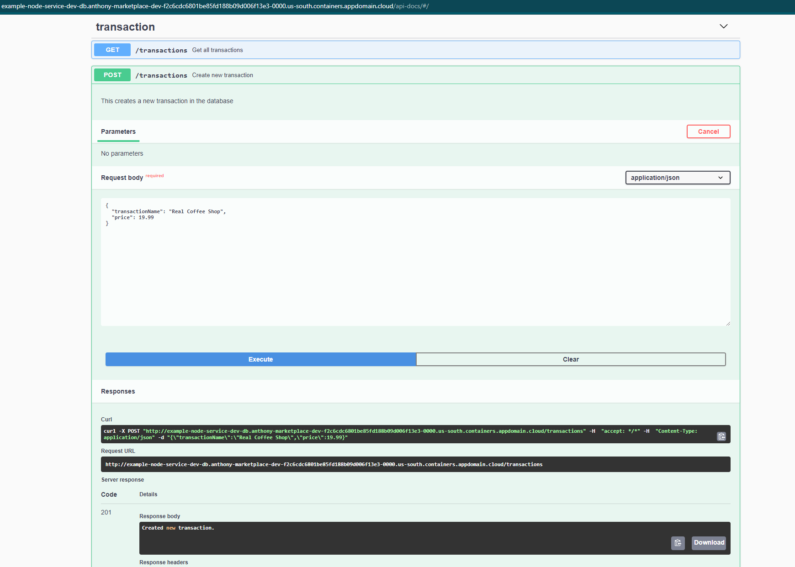

# Securing MongoDB Enterprise on OpenShift

Deploying a MongoDB cluster can be a challenge as there are a lot of pieces and configuration involved like setting up the instances, providing backups, networking, etc. With the MongoDB Enterprise Kubernetes Operator, it minimizes and standardizes these steps in your Kubernetes and/or Openshift environments. This makes deploying a MongoDB in your own environment easier.

With the use of the operator, you can deploy MongoDB resources using the Kubernetes API and manage them natively. In this code pattern, you will learn how to install and use the operator and deploy a replica set. You will also secure the MongoDB deployment with authentication and manage users natively in Kubernetes/OpenShift. You will also secure it by adding TLS with the help of cert-manager. Cert-manager is another operator that allows you to manage certificates natively in the same environment.

When you have completed this code pattern, you will understand how to:

* Use the Red Hat Marketplace and install operators
* Install MongoDB Enterprise Advanced Operator in OpenShift and deploy a MongoDB replica set using the operator.
* Secure the MongoDB deployment with Authentication and add TLS using cert-manager.
* Connect an example microservice with the secure MongoDB deployment.

<!--add an image in this path-->
<!--  -->

## Flow

1. Flow
2. Flow

# Prerequisites

* OpenShift Cluster

# Steps

1. [Clone the repo](#1-clone-the-repo).
2. [Install MongoDB Enterprise Advanced Operator](#2-Install-MongoDB-Enterprise-Advanced-Operator)
3. [Install MonogDB Resources](#3-Install-MonogDB-Resources)
4. [Install cert-manager](#4-Install-cert-manager)
5. [Generate Certificates and enable TLS](#5-Generate-Certificates-and-enable-TLS)
6. [Deploy sample application](#6-Deploy-sample-application)

### 1. Clone the repo

Clone the `openshift-mongodb-enterprise-operator-example` repo locally. In a terminal, run:

```bash
git clone https://github.com/IBM/openshift-mongodb-enterprise-operator-example

cd openshift-mongodb-enterprise-operator-example
```

Make sure you are also logged in your OpenShift cluster as an admin. Then create a project for your MongoDB resources.

```
oc new-project mongodb
```

### 2. Install MongoDB Enterprise Advanced Operator
<!-- register cluster with rh marketplace -->
To use software from the Red Hat Marketplace, you will need to register your cluster in it. This allows the cluster to pull the container images that are used by the software. To register your OpenShift on IBM Cloud, you can follow the instructions here:
* [Register OpenShift cluster with Red Hat Marketplace](https://marketplace.redhat.com/en-us/documentation/clusters#register-openshift-cluster-with-red-hat-marketplace)

> IMPORTANT: For OpenShift on IBM Cloud clusters, you must reload all your worker nodes for the pull secrets from the registration step to apply. Then you can proceed below.

Once you're done registering your OpenShift cluster, you can now proceed on installing the MongoDB Enterprise Advanced Operator in the Marketplace.

To install, go to the main page of the [Red Hat Marketplace](https://marketplace.redhat.com/en-us) and search for MongoDB.


Select the **MongoDB Enterprise Advanced from IBM** and select the **Free Trial** option. This would give you 30 days to try it out. Once you've done that, you should be redirected to the software page, if not - click on the **Workspace** > **My Software** on the top of the page then click on the MongoDB Enterprise.


Now at the Operators tab, you can click on **Install operator** then choose your cluster for the **Target clusters** section and for the **Namespace Scope**, from the drop-down select **mongodb** namespace which you created in step 1.


You should now be back on the Operators tab on your MongoDB Enterprise software page. It would say the **Status** is **Up to date** when it's ready.


You can now proceed to the next step when you see the status above.

### 3. Install MonogDB Resources

Now that you've installed the MongoDB Enterprise Operator, you can now deploy the custom resources it provides (MongoDB Deployment, Ops Manager, Users).

To deploy a MongoDB, you'll need an Ops Manager. The Ops Manager is the management platform for your MongoDB clusters.

Review the `deployment/0-ops-manager.yaml` file. This deploys the Ops Manager and a secret for the initial login. Deploy using the command:

```
oc apply -f deployment/0-ops-manager.yaml
```

The Ops Manager will also deploy a database with 3 replicas. Wait for the `STATE (OPSMANAGER)` to be `Running`. To check,
```
oc get opsmanagers

NAME          REPLICAS   VERSION   STATE (OPSMANAGER)   STATE (APPDB)   STATE (BACKUP)   AGE   WARNINGS
ops-manager              4.2.8     Running              Running         Pending          14m
```

Now, you can go to the Ops Manager dashboard. To get the url,
```
oc get svc

NAME                  TYPE           CLUSTER-IP       EXTERNAL-IP    PORT(S)          AGE
...
ops-manager-svc-ext   LoadBalancer   172.21.118.38    169.xx.xx.xx   8080:31643/TCP   11m
```

Get the EXTERNAL-IP and open your browser on `169.xx.xx.xx:8080`. Log in with your credentials you set in `deployment/0-ops-manager.yaml` and it will ask you to configure the Ops Manager. You can choose to use the default values.

Then, what you'll need to deploy a MongoDB cluster is an API key. It is recommended to use an Organization API key instead of a global one.

To create an Organization, click on the upper right corner that says your account name then click on Organizations. Click on **+ New Organization** to create a new one. Name it `example-organization` or anything.


To create the API key, go to **Access > API Keys** and create a new one. Grab the **Public Key** and place it in the `user` value in `deployment/1-ops-manager-config-secret` then make sure to set the **Organization Permissions** to `Organization Owner`. Enter a short description. Then copy the **Private Key** in the `publicApiKey` value in `deployment/1-ops-manager-config-secret`. You will also need to add an **API Whitelist** entry. Add `172.30.0.0/16`, this is the internal IP addresses of the pods in OpenShift on IBM Cloud.


Then for the ConfigMap on `deployment/1-ops-manager-config-secret`, the values for the following are:

`baseUrl` is from `oc get om ops-manager -o jsonpath='{.status.opsManager.url}'`

`orgId` is in your Organization dashboard **Settings > Organization ID**

`projectName` is the project name you want

Then you can create the secret and config map using:
```
oc create -f  deployment/1-ops-manager-config-secret.yaml
```

Now you can create the MongoDB deployment:
```
oc apply -f deployment/2-mongodb-deployment.yaml
```
This creates a replica set with 3 replicas. To check the status:

```
oc get mongodb

NAME            TYPE         STATE     VERSION     AGE
example-mongo   ReplicaSet   Running   4.2.2-ent   4h18m
```
Wait for its `STATE` to be `Running`. You can also view the Pods that these custom resources created. You should also see the new MongoDB in your Ops Manager dashboard. You'll notice that TLS is not enabled. You can enable it by generating certificates and adding them in your cluster. The next steps will guide you in creating the certificates using cert-manager.

### 4. Install cert-manager

[Cert-manager](https://cert-manager.io/docs/) is a native Kubernetes certificate management controller to automate the management and issuance of TLS certificates from various issuing sources. We're going to use cert-manager to issue self-signed certificates.

Using the OperatorHub in OpenShift, look for `cert-manager` and install it. Then create the namespace for its resources.
```
oc create namespace cert-manager
```

The install the cert-manager components.
```
oc apply -f cert-manager/cert-manager.yaml
```
Make sure all the pods are running.

```
oc get pods -n cert-manager

NAME                                       READY   STATUS    RESTARTS   AGE
cert-manager-54d75944-j25dl                1/1     Running   0          58s
cert-manager-cainjector-745cf7d9b6-9x82s   1/1     Running   0          58s
cert-manager-webhook-7cffc6c677-cphsr      1/1     Running   0          58s
```

### 5. Generate Certificates and enable TLS

To generate self signed certificates, you can generate a certificate authority of your own using the tool `openssl`. Do the following commands to generate the CA's key pair.

```
openssl genrsa -out ca.key 4096
openssl req -x509 -new -nodes -key ca.key -days 3650 -reqexts v3_req -extensions v3_ca -out ca.crt
```

Then create a tls secret using the generated files `ca.crt` and `ca.key`.

```
oc create secret tls ca-key-pair --cert=ca.crt --key=ca.key
```

You can now create the Issuer resource from cert-manager using the secret. Review the `cert-manager/issuer.yaml` file and deploy and check its status:

```
oc apply -f cert-manager/issuer.yaml

oc get issuer

NAME                READY   AGE
mongodb-ca-issuer   True    18s
```

Then, grab the hostnames of the replicas of your MongoDB. You can find them using your **Ops Manager** and go to the **Organization** > **Project** you created and click on the MongoDB deployment.


Take note of the hostnames. Review the `cert-manager/certificates.yaml` and you should find 3 Certificate resources defined. Make sure each certificate corresponds to the hostnames of your replicas. Then deploy:

```
oc apply -f cert-manager/certificates.yaml
```

You can get the certificates managed by cert-manager using this command:

```
oc get certificates

NAME              READY   SECRET            AGE
example-mongo-0   True    example-mongo-0   4s
example-mongo-1   True    example-mongo-1   3s
example-mongo-2   True    example-mongo-2   2s
```

You can also find the tls secrets created using:

```
oc get secret | grep example-mongo

example-mongo-0                                    kubernetes.io/tls                     3      2m14s
example-mongo-1                                    kubernetes.io/tls                     3      2m14s
example-mongo-2                                    kubernetes.io/tls                     3      2m14s
```

The MongoDB expects PEM files (combination of certificate and key). You can same them locally with the format of the filenames like "**mongodbName**-**replicaNumber**-pem" (e.g. example-mongo-0-pem).

You can grab the certificates' secrets and save them using the following commands:

```
oc get secret example-mongo-0 -o jsonpath='{.data.tls\.crt}{.data.tls\.key}' | base64 --decode > example-mongo-0-pem

oc get secret example-mongo-1 -o jsonpath='{.data.tls\.crt}{.data.tls\.key}' | base64 --decode > example-mongo-1-pem

oc get secret example-mongo-2 -o jsonpath='{.data.tls\.crt}{.data.tls\.key}' | base64 --decode > example-mongo-2-pem
```

These create the files `example-mongo-0-pem`,`example-mongo-1-pem`,`example-mongo-2-pem`. Now, you need to create the certificate with the pem files. Secret name should be "**mongodbName**-cert" format.

The following command creates an `example-mongo-cert` with the pem files from above.

```
oc create secret generic example-mongo-cert --from-file=example-mongo-0-pem --from-file=example-mongo-1-pem --from-file=example-mongo-2-pem
```

You also need to create a config map of you custom CA certificate. You can use the `ca.crt` file that you created:

```
oc create configmap custom-ca --from-file=ca-pem=ca.crt
```

Now you can enable TLS on your MongoDB. Uncomment the `security` block on the `deployment/2-mongodb-deployment.yaml`. This enables TLS using your `custom-ca` and also enables authentication using SCRAM. Apply your new changes:

```
oc apply -f deployment/2-mongodb-deployment.yaml
```

This process can take time as the mongo agents enable both tls and authentication. Check the state using `oc get mongodb` again.
```
oc get mongodb

NAME            TYPE         STATE     VERSION     AGE
example-mongo   ReplicaSet   Running   4.2.2-ent   4h18m
```

Also, in your Ops Manager, your deployment should show that TLS and AUTH is enabled


Then you can add a user using the custom resource that the operator provides.

Review the `deployment/3-mongodb-user.yaml`. This creates a secret for the password and a **MongoDBUser** named `mongodb-example-user`. The yaml file also defines the roles it has and in this case, it has privileges of `readWrite` in `example` database. Apply the yaml file:

```
oc apply -f deployment/3-mongodb-user.yaml
```

To check the status, execute the command below. The `STATE` should be `Updated`. You can also check the newly created user in your Ops Manager. It should also show up in MongoDB Users in your **Project** > **Security**

```
oc get mongodbusers

NAME                   STATE     AGE
mongodb-example-user   Updated   72s
```

Now that you have a secure MongoDB deployment, the next step guides you how to connect to this database from your applications or microservices in your OpenShift cluster.

### 6. Deploy sample application

Now you can connect your microservices with the secured MongoDB deployment. An example nodejs application is provided in this repo `example-applications/nodejs`.

You can build and push the example app as a container image in Docker Hub.

```
cd example-applications/nodejs
docker build -t <your-dockerhub-username>/example-nodejs-mongodb:1.0
docker push <your-dockerhub-username>/example-nodejs-mongodb:1.0
```

Then review the `example-applications/nodejs/deployment.yaml` file. The first item is a Secret. Review the values for:
* `MONGODB_REPLICA_HOSTNAMES`. You can find them using your Ops Manager and go to the **Organization** > **Project** you created and click on the MongoDB deployment. Make sure to separate them using a commas.
* `MONGODB_REPLICA_SET` is your MongoDB deployment name.
* `MONGODB_USER`, `MONGODB_PASSWORD`, `MONGODB_AUTH_DBNAME` is the credentials you created using `deployment/3-mongodb-user.yaml` and make sure `MONGODB_DBNAME` is the database where your user has readWrite privileges.
* You can leave `MONGODB_CA_PATH` as is, the deployment resource in the yaml file mounts the `ca-key-pair` secret which you created in Step 5.

Then change the container image name (`anthonyamanse/example-nodejs-mongodb:1.0`) of the deployment in the same yaml file with the container image name you just pushed.

You can now deploy the example application:
```
oc apply -f deployment.yaml
```

Access the application by getting the route:

```
oc get routes
NAME                   HOST/PORT                                                                                                                       PATH   SERVICES               PORT    TERMINATION   WILDCARD
example-node-service   example-node-service-dev-db.anthony-marketplace-dev-f2c6cdc6801be85fd188b09d006f13e3-0000.us-south.containers.appdomain.cloud          example-node-service   <all>                 None
```

Open the route `example-node-service-...cloud/api-docs` **(Add the path /api-docs)** in your browser. You should see a swagger UI - try and add a new transaction using "POST /transactions".



You should see a 201 response. You can now try "GET /transactions" and you can also see the MongoDB documents using your Ops Manager. Go to your **Organization** > **Project** > **Your Deployment** then **Data** tab


## Learn More

* [Learn more about using Mongoose with NodeJS](https://mongoosejs.com/docs/)
* [Learn about Data Modeling with MongoDB](https://docs.mongodb.com/manual/core/data-modeling-introduction/)
* [Official Docs on using MongoDB Enterprise Operator](https://docs.mongodb.com/kubernetes-operator/stable/)
* [Learn more about cert-manager](https://cert-manager.io/docs/)
* [Red Hat Marketplace](https://marketplace.redhat.com/)

## License

This code pattern is licensed under the Apache License, Version 2. Separate third-party code objects invoked within this code pattern are licensed by their respective providers pursuant to their own separate licenses. Contributions are subject to the [Developer Certificate of Origin, Version 1.1](https://developercertificate.org/) and the [Apache License, Version 2](https://www.apache.org/licenses/LICENSE-2.0.txt).

[Apache License FAQ](https://www.apache.org/foundation/license-faq.html#WhatDoesItMEAN)